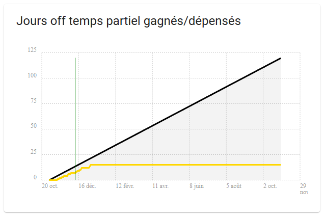
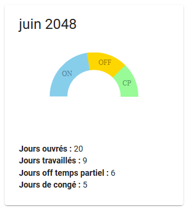

# Party Time

Calcul des congés et jours non travaillés dans le cadre d'un travail à temps partiel.

_This app is only available in French, because it only makes sense for French people under the French work law._

⚠️ _Main repository is here: https://gitlab.com/dsferruzza/party-time_ ⚠️

## Copies d'écran

## Fonctionnalités

- connexion via Google et récupération de l'agenda d'entreprise
- qualifiation de chaque jour de l'année comme étant :
  - un jour de weekend
  - un jour férié
  - un jour travaillé
  - un jour de congé
  - un jour _off temps partiel_ (non travaillé, mais pas déclaré comme congé)
- visualisation mois par mois du nombre de jours travaillés, en congé ou _off temps partiel_
- visualisation année par année du nombre de jours _off temps partiel_ disponibles et utilisés
- fonctionnement hors-ligne (seules la re-synchronisation avec l'agenda et la mise à jour de l'application nécessitent d'être connecté)

## Contexte requis

Cette application cible le contexte suivant :

- travail en temps partiel pour une entreprise
- contrat de travail en forfait jours
- agenda d'entreprise sur Google Agenda

## Utilisation

L'application est disponible à l'adresse : https://dsferruzza.gitlab.io/party-time/

Pour permettre de détecter les jours de congés et les jours _off temps partiel_, il faut avoir dans l'agenda Google des événements dont le nom respecte un format donné qui est réglable.
Par exemple :

- le nom commence par `Congés` pour les jours de congé
- le nom commence par `Absent` pour les jours _off temps partiel_

Ces événements peuvent durer plusieurs jours et recouvrir les weekends et jours fériés.

Le serveur ne fait que servir l'application sous la forme d'un site statique.
Aucune donnée n'est stockée ou envoyée à des tiers.
Les traitements restent en local au niveau du navigateur.

### Configuration

- **Identifiant client pour l'accès à l'API Google (client_id)** : voir la section suivante.
- **Date minimum** : date à laquelle a commencé le temps partiel (les événements antérieurs sont ignorés). Doit être au format ISO 8601. Exemple : `2018-11-01T00:00:00+01:00`.
- **Nombre de jours par an à travailler** : tel que défini dans le contrat de travail. Doit être un nombre entier, probablement inférieur ou égal à 218.
- **Expression régulière pour reconnaitre les événements des jours off temps partiel** : doit être une [expression régulière valide](https://regex101.com/). Exemple : `^Absent|^RTT` (commence par le mot `Absent` ou le mot `RTT`).
- **Expression régulière pour reconnaitre les événements des congés payés** : doit être une [expression régulière valide](https://regex101.com/). Exemple : `^Congés` (commence par le mot `Congés`).

### Obtenir un _client_id_ Google

- aller sur https://console.developers.google.com et se connecter avec le compte Google souhaité
- créer un projet avec n'importe quel nom
- sélectionner le projet ainsi créé dans le menu déroulant en haut à gauche
- dans le `Tableau de bord`, cliquer sur le bouton `Activer les API et les services` et activer `Google Calendar API`
- aller sur la page `Identifiants` via le menu de gauche
- aller sur la page `Écran d'autorisation OAuth` via le menu en haut
- remplir le champ `Nom de l'application` avec un n'importe quel nom
- ajouter dans le champ `Domaines autorisés` le domaine de l'application (le vôtre ou celui de l'instance principale : `dsferruzza.gitlab.io `) et valider avec Entrée
- valider le formulaire
- créer un identifiant de type `ID client OAuth`
- choisir le type `Application Web` et remplir un nom
- ajouter dans le champ `URI de redirection autorisés` l'URL de l'application (la vôtre ou celle de l'instance principale : ` https://dsferruzza.gitlab.io/party-time `) et valider avec Entrée
- valider le formulaire
- récupérez votre **ID client**

## Développement

- installer les dépendances : `yarn install`
- lancer l'application en mode développement : `yarn run start`

Cette application a été créée en utilisant [Create React App](https://github.com/facebookincubator/create-react-app) ; voir le [README associé](README_create-react-app.md).

## Licence

Le code est sous [licence MIT](LICENSE).

Le [logo de l'application](https://www.flaticon.com/free-icon/calendar_1195135) a été fait par [Freepik](https://www.freepik.com) et est disponible sous licence [CC 3.0 BY](http://creativecommons.org/licenses/by/3.0/).
